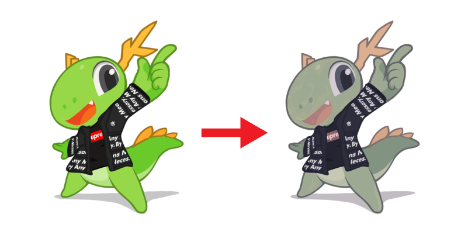

# Catppify 
Convert your image to use Catppuccin! Inspired by similar tool like [prismatica](https://github.com/ahmedmahmud/prismatica)<br>
Supports transparent image and CLI only!

# Installation
Just clone this repo, it's that simple. To update, just `git pull`
# Examples
Generate image with default values (mocha and 4-level noise)
```sh
./catppify background.png
```

Generate image with latte as prefered palette and 2-level noise
```sh
./catppify background -p latte -n 2
```